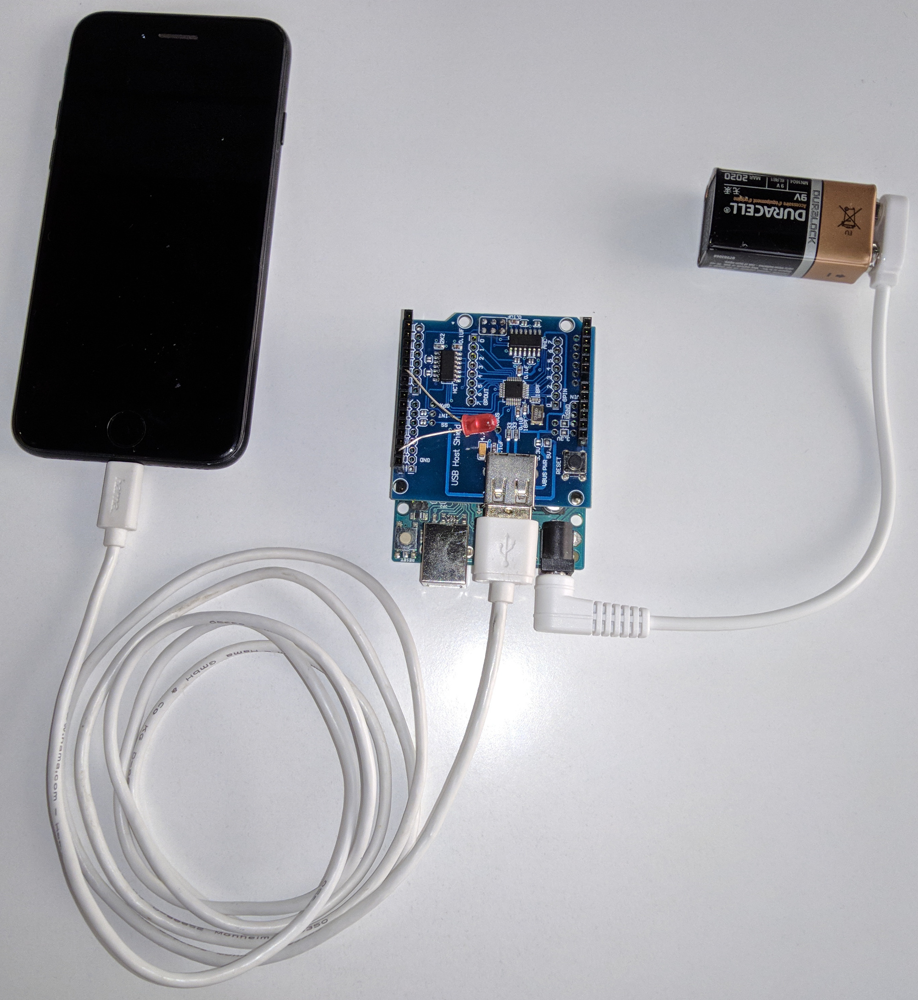

# checkm8-arduino PoC

## About

This repository contains the [checkm8](https://github.com/axi0mX/ipwndfu/blob/master/checkm8.py) port for Arduino and USB Host Shield.
The sketch works only for `iPhone 7`; for other platforms, it is necessary to replace `payload` and `overwrite` in `constants.h`.

## Building

To build the device itself, we need:

* Arduino Uno;
* USB Host Shield (based on MAX3421E controller);
* LED (must be connected to pin 6).

You can use the `Arduino IDE` to upload the sketch.

To successfully compile the sketch, you need to install the [USB Host Library Rev.2.0](https://github.com/felis/USB_Host_Shield_2.0) and apply the patch from the file `usb_host_library.patch` to it.

## Using

1. Connect `iPhone 7` in `DFU`-mode to the USB Host Shield (when the device is detected, the LED will flash 3 times);
2. Wait for the LED to light up.

After that, the `PWND:[checkm8]` line will be added to the `iPhone 7` serial number in DFU mode. Now you can work with `iPhone 7` using the [ipwndfu](https://github.com/axi0mX/ipwndfu) utility.
 
